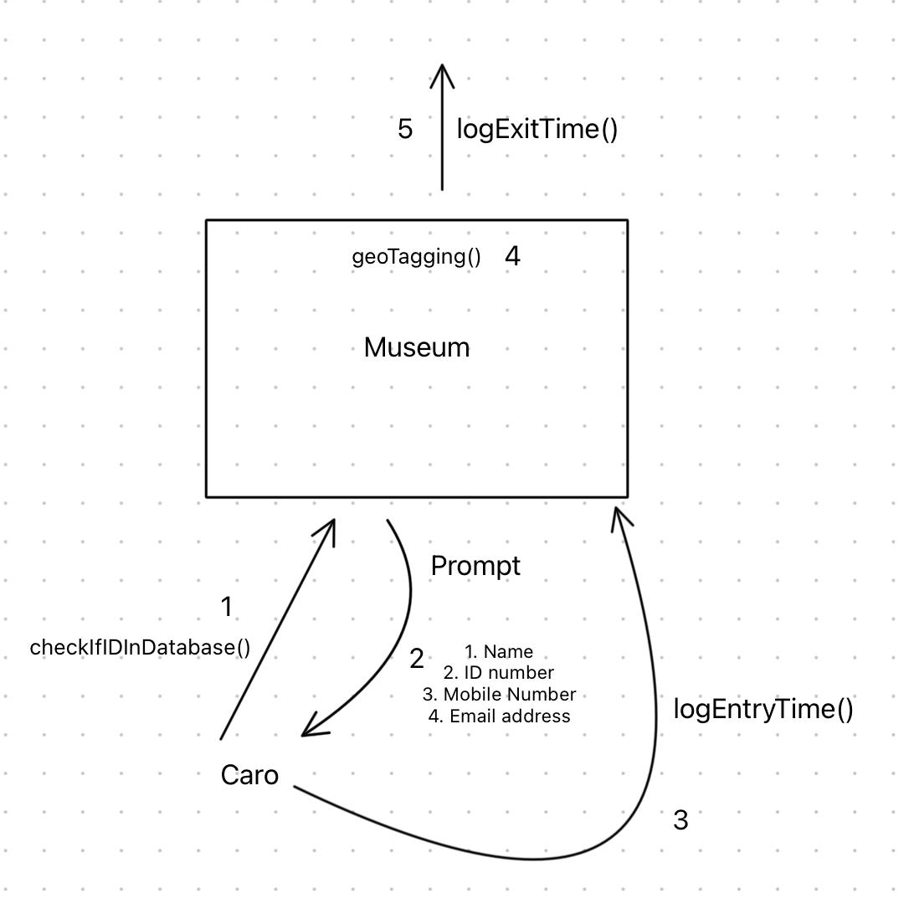

# This is a full stack pre-interview test

## Project Overview

Caro is attending Workshop X in Nairobi at the Museum. Upon arrival at the entrance, she presents her ID and is given a QR code to scan. The QR code opens a form on her phone, prompting her to fill in her name, ID number, mobile number, and email address. She then checks a box to accept the terms and conditions. When she clicks it, a detailed terms and conditions document appears, requiring her to scroll to the bottom and append her signature (in a Docusign-style format). After submitting the form, a message pops up notifying her that her location is being geotagged while she is on the premises. Upon leaving the premises, a message will appear on her phone indicating that geotagging has stopped. The next time Caro attends an event organized by this organizer at any location, she only needs to provide her phone number, and all her information will be retrievable, allowing her to enter the premises again with geotagging. The organizer can see who attended, what time they arrived, and what time they left.

## Approach

1. ⁠When Caro reaches the workshop location, after presenting her ID, a database query is performed to check if Caro's ID number is in the database. If her ID number is in the database, go to step 3.
2. ⁠If the ID number is not in the database, Caro is prompted to fill in her name, ID number, mobile number, and email address. She is also prompted to accept the terms and conditions.
3. ⁠A message is displayed that her location will be tracked while on premise and the time she enters is logged into the database
4. ⁠When Caro leaves the premise the geotagging is stopped and the time she left is logged into the database.

# Implementation

- This project will be over-engineered to meet practices that would be used in production
- The project stack is:
  1. NodeJS for the backend
  2. ReactJS with CRA (Create React App) with TypeScript for the front-end
  3. MongoDB for the database

## Backend

### Dependencies

1. Express - A backend web framework for NodeJS
2. Mongoose - MongoDB object modelling tool
3. Nodemon (devDependency) - a tool used to reload the server when a change is made
4. Dotenv - A tool to access environment variables using `process.env` in files

### Steps to follow to run the backend

1. Copy `.env.example` into `.env` and replace the PORT and MONGO_URI with your own values
2. Run `npm i` in your terminal, make sure you're in the backend directory to install the dependencies.
3. To run the development server, run `npm run dev`

#### Steps I took to set up the backend

1. Initialised a new NodeJS project by `npm init -y`
2. Create an express server that listens on a PORT (8001)
3. Created a project in MongoDB Atlas, in this project, I created a cluster and copied the connection URI into the `.env`.
4. Using `mongoose` I connected to the MongoDB cluster, remebering to add a database name after `mongodb.net`.
5. After the database had connected successfully, I created a user model with the fields I would need: name, ID number, mobile number, and email address.
6. I then defined two API endpoints that would be useful to consume from the front-end:

- `/api/createUser` - A POST request that creates a user in the database.
- `/api/getUser/:IdNumber` - A GET request that gets a user by their ID number from the database.

## Frontend

### Dependencies

1. TailwindCSS - a CSS framework for styling
2. React Router DOM - implement routing

### Steps to follow to run the backend

1. Run `npm i` in your terminal, make sure you're in the frontend directory to install the dependencies.
2. To run the development server, run `npm run start`

### Steps I took to set up the frontend

1. Create a react app using `npx create-react-app@latest ./ --template --typescript`.
2. I installed TailwindCSS for the styling.
3. I removed the files I would not use inside `/src`.
4. Inside `App.tsx`, I created a component `<IDNumberForm />` that a would take in a user's ID number, and consume the `/api/getUser/:IdNumber` to check if a user exists in the database.
5. At this point I needed to enable CORS (Cross-Resource Origin Sharing) on the backend by `npm i cors` in the backend, and running `app.use(cors());` before I start calling endpoints.
6. I used `fetch()` inside the handleSubmit of the `<IDNumber />` form to check if a user exists.
7. I installed `react-router-dom` and created a `Router.js` in the root of my project which will define my project routes.
8. Inside the `App.tsx` I replaced the content with a `<RouterProvider />` and created three pages `<LandingPage />`, `<HomePage />` and `<AddDetailsPage />`.
9. Inside `<AddDetailsPage />`, there is a `<AddDetailsForm />`, this makes a POST request to the API `/api/createUser` with the user's data.
